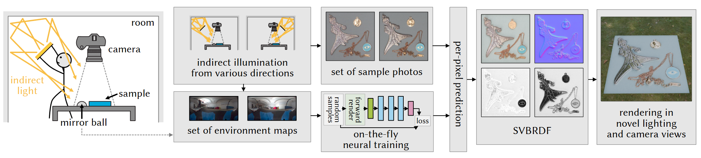

# BounceBRDF: High-Gloss SVBRDF Capture Using Bounce Light

[](https://eg2026.eu/)
[](https://onlinelibrary.wiley.com/journal/14678659)
[](https://reality.tf.fau.de/publications/2026/iser2026highgloss/iser2026highgloss.html)

**[Tomáš Iser](https://tomasiser.com)<sup>1,2</sup> &nbsp;·&nbsp; [Andrei-Timotei Ardelean](https://reality.tf.fau.de/staff/t.ardelean.html)<sup>1</sup> &nbsp;·&nbsp; [Tim Weyrich](https://reality.tf.fau.de/weyrich.html)<sup>1</sup>**

<sup>1</sup>Friedrich-Alexander-Universität Erlangen-Nürnberg (FAU) &nbsp;·&nbsp; <sup>2</sup>Charles University, Faculty of Mathematics and Physics

*Computer Graphics Forum (Proc. Eurographics)*, Vol. 45, No. 2, 2026.

📄 **[Project page & paper](https://reality.tf.fau.de/publications/2026/iser2026highgloss/iser2026highgloss.html)** &nbsp;·&nbsp; 📚 **[BibTeX](https://reality.tf.fau.de/publications/2026/iser2026highgloss/iser2026highgloss.bib)**

---



## ✨ Examples

The animations below were rendered in Blender from real objects captured using our method.

See [our Hugging Face repository](https://huggingface.co/datasets/fau-vce/BounceBRDF/tree/main) for various high-resolution textures and captures.


## Method at a Glance

We recover a spatially-varying Disney Principled BRDF (base color, roughness, metallicness, normal map) from a small set of photographs — typically nine — lit by a handheld light bounced off a wall or ceiling.
A **mirror sphere** placed next to the sample captures the lighting environment in each photo.
A lightweight per-pixel MLP is then **trained on the fly** against synthetic renderings produced by Mitsuba 3, inverting the rendering equation for every pixel independently.

The entire process only takes a couple of minutes (NVIDIA RTX 4080) and works even for large resolutions (4096×4096 and more).
No precollected datasets are required, the training is done on synthetic data generated on-the-fly.
See the [paper](https://reality.tf.fau.de/publications/2026/iser2026highgloss/iser2026highgloss.html) for full methodological details.

The output SVBRDF textures are **directly compatible with real-time game engines and offline renderers**.
Just load the `basecolor.png`, `roughness.png`, `metallic.png`, and `normal.png` into your material.
In [Blender](https://www.blender.org/) and [Mitsuba 3](https://mitsuba.readthedocs.io/en/stable/), you will want to use the "Principled BSDF" model.

## Installation

We strongly recommend that you install:

- **Python ≥ 3.11**
- **[uv](https://docs.astral.sh/uv/)**

although you can use any alternatives that support the `pyproject.toml` configuration.

**CUDA 12.6 (recommended if you have a GPU):**
```bash
git clone https://github.com/fau-vce/BounceBRDF.git
cd BounceBRDF
uv sync --extra cu126
```
You can also manually edit the `pyproject.toml` file for other PyTorch configurations / different CUDA versions.

**CPU-only:**

If you do not have CUDA (such as on Mac), you can install the CPU version.
However, you will need to also install [LLVM](https://llvm.org/) on your machine because our project depends on the vectorized variants of [Mitsuba 3](https://mitsuba.readthedocs.io/en/stable/), which require either CUDA or LLVM.

```bash
git clone https://github.com/fau-vce/BounceBRDF.git
cd BounceBRDF
uv sync --extra cpu
```

**Running the code:**

After you install everything, you can run our executable scripts with `uv run`, such as:

```
uv run src/bouncebrdf/extract_envmap.py --help
```
or
```
uv run python -m bouncebrdf.extract_envmap --help
```

Alternatively, you can activate the virtual environment with `source .venv/bin/activate` (Linux/macOS) or `.venv\Scripts\activate` (Windows).

## Pipeline

Our code consists of three executable scripts: `extract_envmap`, `fit`, and `render` (optional).

The three scripts can be run in sequence: first extract environment maps from the mirror sphere, then fit the SVBRDF, then optionally render the result.

```
photos with mirror sphere (*.exr)
    │             │
    │             ▼
    │    ┌─────────────────┐
    │    │  extract_envmap │ GUI: right-click 3 points on sphere
    │    └────────┬────────┘
    │             │ *.envmap.exr
    │        ┌────┴──────────────────────────────┐
    ▼        ▼                                   ▼
  ┌──────────────────────┐                       │
  │         fit          │ train & infer SVBRDF  │
  └──────────┬───────────┘                       │
             ▼ basecolor.png  roughness.png      │
             │ metallic.png   normal.png         │
             │                                   │
             │          (optional step)          │
             └─────────────────┬─────────────────┘
                               ▼ textures & envmaps
                      ┌─────────────────┐
                      │     render      │  Mitsuba 3
                      │   (optional)    │  path tracer
                      └────────┬────────┘
                               │ *.render.exr
                               ▼
                rendered images for validation
```

## Example / demo data

We prepared a dataset of captures that you can run without having your own photos.
The [dataset is stored on Hugging Face](https://huggingface.co/datasets/fau-vce/BounceBRDF).
There are several ways how a dataset can be downloaded from Hugging Face, [please see their documentation](https://huggingface.co/docs/hub/datasets-downloading).

The **easiest way to download the demo data** is using the provided script, which saves everything into the `data/` directory:

```bash
uv run src/bouncebrdf/download_data.py
```

Careful, the demo dataset is 12 GB and downloading might take a while on slower connections.
You can also choose to only download a subset of the full dataset.
We have published four subsets: `arch1`, `re2`, `vr1`, `vr3`.
To download only one of them, pass its name as an argument:

```bash
uv run src/bouncebrdf/download_data.py arch1
```

Because the demo data already have the necessary `*.envmap.exr` files provided, you can choose to skip the `extract_envmap` step and run `fit` directly:

```bash
uv run src/bouncebrdf/fit.py 'data/arch1/*.exr'
```

By default, your output will be stored in `data/arch1/results_1000_0.1` (1000 iterations with 0.1 noise).

## Scripts

### 1. `extract_envmap` — Extract environment maps from photos

Opens a GUI on the first image so you can right-click three points on the mirror sphere rim. The script fits a circle to those points and then unprojects the sphere reflection into a latitude-longitude environment map for every input image.
For example, for `0001.exr`, it generates `0001.envmap.exr`.

Sometimes, it can be hard to manually pick where the sphere boundaries are on a photograph.
For that reason, we also include a [special background](./dreambb-1_0-batton-sized.pdf) that you can print and place under the sphere, which then makes it easier to see where exactly the sphere begins and ends.

```bash
uv run src/bouncebrdf/extract_envmap.py 'data/arch1/*.exr'
```

**Output:** `<name>.envmap.exr` next to each input image.

Key options:
| Flag | Description |
|---|---|
| `-h, --help` | Show detailed information about all command line arguments |
| `--no-skip` | Disable skipping (by default, `*.envmap.exr` files are skipped to avoid creating `*.envmap.envmap.exr` files) |
| `--threads N` | Parallel workers for batch processing (default: 8) |
| `--ui-exposure EV` | Brighten/darken the GUI preview (default: 0.0) |
| `-f, --force` | Overwrite existing `*.envmap.exr` files |

---

### 2. `fit` — Fit SVBRDF textures

Trains a per-pixel MLP on Mitsuba-rendered synthetic data conditioned on the extracted environment maps, then runs inference to produce the four SVBRDF texture maps. Requires a matching `*.envmap.exr` file for every input image (generated by `extract_envmap`).

```bash
uv run src/bouncebrdf/fit.py 'data/arch1/*.exr'
```

**Output:** a `results_<iterations>_<noise>/` directory next to the images, containing `basecolor.png`, `roughness.png`, `metallic.png`, `normal.png`, and `trained_model_weights.pth`.

Key options:
| Flag | Description |
|---|---|
| `-h, --help` | Show detailed information about all command line arguments |
| `--subset N` | Use only the first N images (alphabetical order) |
| `--crop TOP LEFT H W` | Crop input images before processing |
| `--resolution-scaling S` | Downscale inputs (e.g. `0.5` for half resolution) |
| `--training-iterations N` | Training iterations (default: 1000) |
| `--training-batch-size N` | Batch size (default: 4096) |
| `--training-noise-scale S` | Noise scale during training (default: 0.1) |
| `--training-learning-rate LR` | Learning rate during training (default: 0.001) |
| `--load-trained-weights FILE` | **Skip training**, load saved weights instead (from an existing `trained_model_weights.pth` file) |
| `--no-log` | Disable log-space reflectance preconditioning in the neural network (useful only for noisy photos) |
| `--mitsuba-variant VARIANT` | Mitsuba variant (default: `cuda_ad_rgb` / `llvm_ad_rgb`) |
| `-f, --force` | Overwrite existing output files |

---

### 3. `render` — Re-render the fitted material

Re-renders the fitted SVBRDF under one or more environment maps using Mitsuba's path tracer. Useful for validation or relighting.

```bash
uv run src/bouncebrdf/render.py 'renders/' 'data/arch1/results_1000_0.1/' 'data/arch1/*.envmap.exr'
```

Arguments: `OUTPUT_DIRECTORY  TEXTURES_DIRECTORY  ENVMAP_FILE [...]`

**Output:** `<envmap-name>.render.exr` per environment map in the output directory.

Key options:
| Flag | Description |
|---|---|
| `-h, --help` | Show detailed information about all command line arguments |
| `--spp N` | Samples per pixel (default: 64; use higher values such as 1024 for less rendering noise) |
| `--mitsuba-variant VARIANT` | Mitsuba variant (default: `cuda_ad_rgb`) |
| `-f, --force` | Overwrite existing output files |

## Citation

If our work is useful to your research, please cite:

```bibtex
@article{iser2026highgloss,
  author    = {Iser, Tom\'{a}\v{s} and Ardelean, Andrei-Timotei and Weyrich, Tim},
  title     = {High-Gloss {SVBRDF} Capture Using Bounce Light},
  journal   = {Computer Graphics Forum (Proc. Eurographics)},
  volume    = {45},
  number    = {2},
  year      = {2026},
  month     = may,
  publisher = {Eurographics Association},
  authorurl = {https://reality.tf.fau.de/pub/iser2026highgloss.html},
}
```

## Acknowledgments

This project has received funding from the European Union's Horizon 2020 research and innovation programme under the Marie Skłodowska-Curie grant agreement No 956585. This work was further supported by the Charles University grant SVV-260822.
